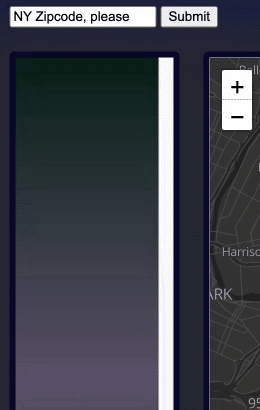
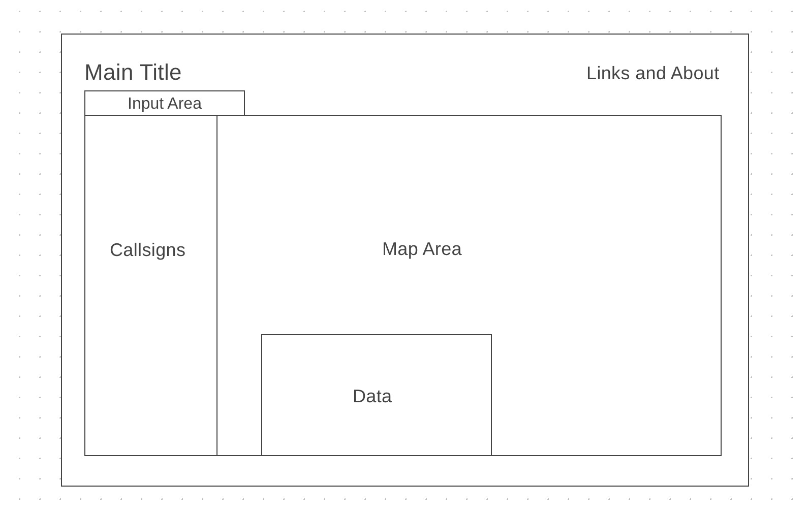

# Signal Mapper

Signal Mapper is a visualization of amateur radio license locations in the state of New York grouped by zipcode. Each license is represented by its current holder's registered callsign. These callsigns are unique indentifiers provided by the Federal Communications Commission. The initial state is a map centered on New York City. After providing a valid zipcode from New York state a list of callsigns is dynamically generated to the left of the map. Each callsign is clickable resulting in its registered license location to be plotted and focused via animation onto the map. Concurrently a small window animates onto the map area displaying any relevant data available to the license received from a http request made to the callook.info API.

## Functionality and MVPs

In Signal Mapper, users are able to:

- Input location data in zipcode format. The app then fetches any callsigns related to this location from data provided by the FCC and represents them in a vertical scrollable field.

  

- Choose a callsign by clicking on the list initiating an async request to the external API for a data object related to the specific callsign.

    ```js
      fetch(`https://callook.info/${this.csString}/json`)
      .then(res => {
        if (res.ok) {
          return res.json();
        } else {
          throw res;
        }
      })
      .then(data => {
        console.log(data);
      .catch(error => console.error(error));

- The data object is unpacked and rendered as an HTML list.

  ```js
  createDataSection (obj) {
    let list = document.getElementById("licenseData")
    list.innerHTML = "";

    for (const property in obj) {
      let dataItem = document.createElement("li");

      if (obj[property] instanceof Object) {
        console.log("Unpacking Object")
        dataItem.innerHTML = `${titleize(property)}: `
        this.objLister(obj[property], dataItem)
      } else {
        dataItem.innerHTML = `${titleize(property)}: ${obj[property]}`;
        }
        
      list.appendChild(dataItem);
    }
  }

  objLister (obj, node) {
    let subList = document.createElement("ul");

    for (const property in obj) {
      let subItem = document.createElement("li");
      subItem.innerHTML = `${titleize(property)}: ${obj[property]}`;
      subList.appendChild(subItem);
    }
    node.append(subList);
  }

- Geographic coordinates from the data are used to create and focus via animation onto the map.

  ```js
  this.setLicense(data);
  this.createDataSection(this.license);
  let loc = this.snatchCoordz(this.license)
  let marker = L.marker(loc).addTo(map);
  marker.bindPopup(this.csString).openPopup();
  map.flyTo(marker.getLatLng());

- The data window is animated onto the map area displaying data for the last-clicked callsign.


In addition, this project includes:

1. This README
2. An about modal with instructions
3. A favicon

## Wireframe



## Technologies, Libraries, APIs

This project was be implemented with the following technologies

- Leaflet, an opensource JS module for interactive maps
  - <https://leafletjs.com/>
- The FCC Universal Licensing System to provide callsign
  - <https://www.fcc.gov/wireless/universal-licensing-system>
- The callook.info API to retrieve license data
  - <https://callook.info/>
- Webpack and Babel to bundle and transpile
- npm to manage project dependencies

## Anticipated Features

1. A webplayer to listen amateur radio frequencies
2. A noise mixer to combine sounds from other sources

## Timeline

### Friday and Weekend

- Begin backend interaction with the APIs to gather resources
- Implement app armature for interaction

### Monday

- Work with forms and API data being retrieved

### Tuesday

- Have a working version of data retrieval and display
- Continue styling and animations/interactions

### Wednesday

- Visually polish as much as possible

### Thursday Morning

- Deploy

## CC Licensing

- Icons by inconmonstr
  - <https://iconmonstr.com/>
- Map tiling by Stadia Maps
  - <https://stadiamaps.com/guides/interactive-maps/>
- Fonts by Google Fonts
  - <https://fonts.google.com/specimen/Racing+Sans+One>
  - <https://fonts.google.com/specimen/IBM+Plex+Mono>
